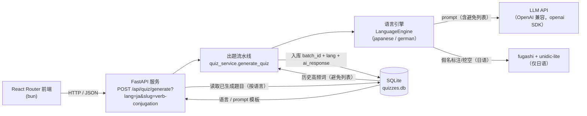
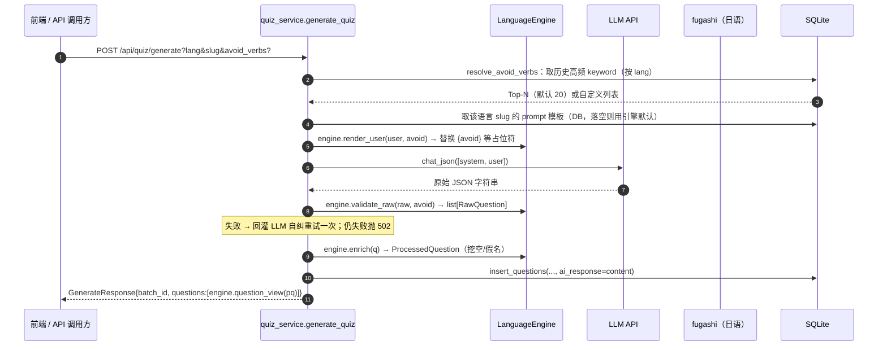

# 多语言出题服务 —— 架构设计

> 目的：把`skill_japanese-verb-quiz.md`从"纯 LLM 上下文内完成出题"改造为
> **FastAPI 服务 + SQLite + LLM 按需调用**。由 Python 承担确定性工作
> （假名标注、挖空、选项洗牌（如有）、规则校验、入库），把省下的 token
> 还给真正需要"创作"的环节。
>
> 演进：本文档是由日语单引擎版本（`backend/specification/architecture.md`）
> 泛化而来的**多语言**架构。当前已落地**日语 `ja`** 与**德语 `de`** 两个语言引擎，
> 两者题型与 JSON 结构均由各自的语言引擎定制。

---

## 1. 背景与目标

| 痛点 | 原因 | 架构应对 |
| --- | --- | --- |
| 整个流程消耗 token 多 | ① 每个汉字都要 LLM 手工标注假名 ② 出题与批改的完整讲解都在上下文里 ③ prompt 冗长 | 假名标注交给 **fugashi**；LLM 只输出精简 JSON（不输出假名、不输出讲解）；服务只负责产出题目与标准答案 |
| 题目结构/覆盖不稳定 | 规则靠 prompt 约束，缺少硬校验 | **Python 侧强校验**（题量、构成、去重、避开历史高频词），不合格自动让 LLM 自纠重试 |
| 单语言硬编码，难以扩展 | quizzes 表、路由、校验都写死日语动词规则 | 语言特有逻辑收敛到 `app/engines/<lang>`，经统一 `LanguageEngine` 接口被流水线调度；新增语言=加一个引擎包并注册一行 |
| 单选题选项顺序 | 选项顺序由 LLM 决定 | 洗牌（如需要）是辅助逻辑，交给 Python；日语/德语当前均为**填空**题，直接去掉了选项概念 |

核心原则：

1. **确定性工作一律交给 Python**：假名标注（fugashi）、挖空、选项洗牌（如有）、规则校验、SQLite 入库。
2. **LLM 只做"创作"**：选词、造句、给提示。输出**严格 JSON**，不含假名、讲解、Markdown。
3. **语言无关分层**：通用部分（LLM client / DB / HTTP 路由 / 设置 / 语言管理）与语言专属部分（prompt、校验、标注 / 序列化）分离。
4. **题型与 JSON 由引擎定制**：每个引擎的 `question_view` 决定该语言题目的对外 JSON 形状（日语带假名、德语不带；两者都是填空）。底层数据统一经 `result_json` 留存。
5. **服务是唯一出题入口**：前端只调服务、按 Batch 展示题目；批改/讲解留在客户端或后续接口。

---

## 2. 总体架构



组件职责：

| 组件 | 职责 |
| --- | --- |
| **React 前端** | 设置 LLM、管理语言、管理 prompt 模板、按语言+Batch 查看题目 |
| **FastAPI 服务** | 出题流水线的唯一执行者：取历史 → 取模板 → 调 LLM → 校验 → 标注 → 入库 → 返回；语言/模板 CRUD |
| **语言引擎 `LanguageEngine`** | 抽象"语言专属逻辑"：`render_user` / `validate_raw` / `enrich` / `prompt_docs` / `question_view` / `init` |
| **通用流水线 `quiz_service`** | 与语言无关：编排引擎、自纠重试、入库、返回 |
| **LLM** | 纯创作：选词、写例句、给提示，输出原始 JSON |
| **fugashi + unidic-lite** | 汉字→平假名标注（日语引擎内，德语不需要） |
| **SQLite** | 多表持久化：语言、batch、题目（含 `result_json` 全量载荷）、prompt 模板 |
| **设置 / 语言管理** | 运行时配置 LLM；语言表与模板 CRUD |

### 2.1 语言与模板的元数据流

- 启动时（`main.lifespan`）：`init_db()` → 从 `REGISTRY` **种子 `languages` 表**（`ja`/`de`）
  → 按引擎 `prompt_docs()` 种子 `quiz_templates`（`on_conflict_do_nothing`，不覆盖用户编辑）。
- `languages` 表是权威数据源：前端语言下拉、模板 CRUD 的语言校验都读它；用户可新建**任意**
  `language_code`（即使尚无引擎，生成时才会因无引擎而 404）。
- `quiz_templates` 用 `language_id`（FK→`languages.id`）关联，而不是存 code 文本；
  改名 code 不会断掉模板关联。

---

## 3. 一次生成的数据流（时序）



---

## 4. API 设计

`Base: http://<host>:<port>`，默认端口由 uvicorn 决定（开发常用 8070/8000）。
语言以查询参数或路径段体现；无对应引擎的语言在生成/读取时返回 404。

### 4.1 `GET /health`
存活检查，返回 `{"status":"ok"}`。

### 4.2 LLM 设置 `GET/POST /api/settings`、`POST /api/settings/reset|test`
见 §8。

### 4.3 `POST /api/quiz/generate?lang=&slug=` ← 核心接口

生成并入库一批题目。`lang`（如 `ja`）与 `slug`（如 `verb-conjugation`）为**查询参数**。
请求体（可选）：

```jsonc
{
  "avoid_verbs": ["する", "食べる"],  // 可选：显式禁用词
  "auto_exclude": 20                 // 可选默认 20：未传 avoid_verbs 时自动取历史高频 Top-N
}
```

响应体（`questions` 形状由语言引擎 `question_view` 决定，见 §5）：

```jsonc
{
  "batch_id": "a1b2c3d4-...",   // 本批 UUID，用于归组
  "questions": [
    {
      // 日语（ja）：
      "category": "五段动词", "type": "て形",
      "keyword": "遊ぶ", "keywordFurigana": "遊(あそ)ぶ",
      "sentence": "友達と【遊んで】から、家に帰ります。",
      "sentenceFurigana": "友達(ともだち)と遊(あそ)んでから、家(いえ)に帰(かえ)ります。",
      "sentenceQuiz": "友達(ともだち)と_____から、家(いえ)に帰(かえ)ります。",
      "translation": "和朋友玩完就回家。",
      "rightAnswer": "遊んで",
      "hintZh": "五段动词鼻音便：词尾ぶ→んで。"
    }
    // 德语（de）：{category, type, verb, sentence, sentenceQuiz, translation, hintZh}
    //   无 keyword/keywordFurigana、无 rightAnswer（见 §5 差异表）
  ]
}
```

> 说明：`sentenceQuiz` 是把 `【...】` 换成 `_____` 的挖空句（已含注音）。`hintZh` 为中文提示，
> 契约上要求**不直接写出答案**。

### 4.4 `GET /api/{lang}/verbs/frequent?limit=&since_days=`
返回该语言历史出现次数最多的 `keyword`（`since_days>0` 只统计最近 N 天）。

```jsonc
{ "verbs": [ {"keyword": "食べる", "count": 12}, ... ] }
```

### 4.5 `GET /api/{lang}/quiz/history?limit=&offset=`
按时间倒序返回该语言的已入库题目（含 `batch_id`，便于按批还原）。

### 4.6 `GET /api/{lang}/quiz/{id}`
按自增 id 取单题，不存在返回 404。

### 4.7 语言管理 `GET /api/languages` · `POST /api/languages` · `PUT /api/languages/{code}`
语言表 CRUD（新建可任意、改名查重、display_name 自定义）。冲突返回 409，缺失 404。

### 4.8 Prompt 模板 `GET/POST /api/prompts` · `PUT/POST …/{lang}/{slug}/edit|reset`
模板（system/user）按语言分组管理；大多数字段在 DB 层按 code→`language_id` 解析。
`reset` 用引擎 `prompt_docs()` 的默认值覆盖当前编辑值。

> 进化说明：早期版本生成接口为 `POST /api/{lang}/quiz/generate`（路径段取语言），
> 现收敛为**平坦路由** `POST /api/quiz/generate` + `lang`/`slug` 查询参数，
> 更贴合"语言只是参数"的泛化模型。

---

## 5. 数据模型（SQLite）

`data/quizzes.db`（`DB_PATH` 可配）。**多表**存储，由 `database.py`（SQLAlchemy 2.0 async + aiosqlite）管理。

### 5.1 `languages` —— 语言注册表

```sql
CREATE TABLE languages (
    id            INTEGER PRIMARY KEY AUTOINCREMENT,
    language_code TEXT    NOT NULL UNIQUE,
    display_name  TEXT    NOT NULL,
    created_at    TEXT    NOT NULL DEFAULT (datetime('now','localtime'))
);
```

### 5.2 `quiz_batches` —— 一次生成的组

```sql
CREATE TABLE quiz_batches (
    id            INTEGER PRIMARY KEY AUTOINCREMENT,
    batch_id      TEXT    NOT NULL UNIQUE,      -- UUID
    language      TEXT    NOT NULL,             -- 语言代码（3NF，不冗余到 quizzes）
    num_questions INTEGER NOT NULL DEFAULT 0,
    ai_response   TEXT,                         -- LLM 原始回答（留档/审计）
    created_at    TEXT    NOT NULL DEFAULT (datetime('now','localtime'))
);
```

### 5.3 `quizzes` —— 泛化精简表

一道题一行。**只保留可查询 / 用于统计的列**；完整可渲染载荷放在 `result_json`
（引擎序列化的权威来源）。`language` 通过 `quiz_batches` 联表得到（本表不冗余），保证 3NF。

```sql
CREATE TABLE quizzes (
    id            INTEGER PRIMARY KEY AUTOINCREMENT,
    batch_id      TEXT    NOT NULL REFERENCES quiz_batches(batch_id),
    category      TEXT    NOT NULL,        -- 如 五段动词 / Akkusativ
    sub_category  TEXT    NOT NULL,        -- 引擎的 type：如 て形 / た形 / 定冠词
    keyword       TEXT    NOT NULL,        -- 引擎的 verb/词条（日语为辞书形）
    lang          TEXT    NOT NULL,        -- 语言代码（供高频统计便捷过滤）
    sentence      TEXT    NOT NULL,
    sentence_quiz TEXT,
    translation   TEXT    NOT NULL,
    right_answer  TEXT    NOT NULL,
    result_json   TEXT    NOT NULL,        -- ProcessedQuestion.model_dump()（全量，JSON）
    created_at    TEXT    NOT NULL DEFAULT (datetime('now','localtime'))
);
CREATE INDEX idx_quizzes_keyword ON quizzes(keyword);
CREATE INDEX idx_quizzes_created ON quizzes(created_at);
CREATE INDEX idx_quizzes_batch   ON quizzes(batch_id);
```

> 设计要点：曾有过 `verb_furigana`/`options`/`answer_position` 等列，后因**不具备跨语言一般性**
> 被移除——这些信息完全可从 `result_json` 还原。查询/展示经由 `engine.question_view(record)`
> 重建，读接口在其上附加 `id/language/batch_id/created_at` 元数据。

### 5.4 `quiz_templates` —— 每 (语言, slug) 一套 prompt

```sql
CREATE TABLE quiz_templates (
    id          INTEGER PRIMARY KEY AUTOINCREMENT,
    language_id INTEGER NOT NULL REFERENCES languages(id),
    slug        TEXT    NOT NULL,      -- 如 verb-conjugation / article-case
    title       TEXT    NOT NULL,
    system      TEXT    NOT NULL,
    user        TEXT    NOT NULL,
    created_at  TEXT    NOT NULL DEFAULT (datetime('now','localtime')),
    UNIQUE(language_id, slug)
);
```

### 5.5 高频词统计（按语言）

```sql
SELECT keyword, COUNT(*) AS cnt
FROM quizzes
WHERE lang = ? AND (? IS NULL OR created_at >= ?)
GROUP BY keyword
ORDER BY cnt DESC, keyword
LIMIT ?;
```

---

## 6. 核心模块设计

```
backend/
├── main.py                 # FastAPI 入口（lifespan：init_db + 种子语言/模板 + engine.init）
├── app/
│   ├── config.py           # 环境默认配置（LLM 默认值、DB_PATH）
│   ├── schemas.py          # 通用 Pydantic：RawQuestion/ProcessedQuestion/请求响应
│   ├── llm.py              # OpenAI 兼容 /chat/completions（openai SDK）
│   ├── database.py         # 多表持久化 + 语言/模板 CRUD
│   ├── engines/
│   │   ├── base.py         # LanguageEngine 抽象 + shuffle_options/shuffle_questions/frequent_keywords
│   │   ├── __init__.py     # REGISTRY + get_engine(code)
│   │   ├── japanese/       # 引擎：prompt + furigana + 校验 + 分类字面量
│   │   └── german/         # 引擎：第三/第四格阳性冠词填空
│   ├── services/
│   │   ├── quiz_service.py # 通用流水线：编排引擎、自纠重试、入库
│   │   └── runtime_settings.py # 运行时 LLM 配置 + 持久化
│   └── routers/
│       ├── quiz.py         # POST /api/quiz/generate + /api/{lang}/quiz/{history,{id}}
│       ├── verbs.py        # /api/{lang}/verbs/frequent
│       ├── settings.py     # /api/settings...
│       ├── prompts.py      # /api/prompts（模板 CRUD）
│       └── languages.py    # /api/languages（语言 CRUD）
└── data/                   # SQLite + llm_settings.json（gitignore）
```

### 6.1 语言引擎接口（`app/engines/base.py`）

```python
class LanguageEngine(ABC):
    language_code: str
    display_name: str

    def render_user(self, user: str, avoid_verbs: list[str]) -> str: ...
    #   → 把 {avoid} 等占位符替换进 user 模板（可 override 增加语言专属占位符）
    def validate_raw(self, data: object, avoid_verbs: list[str]) -> list[RawQuestion]: ...
    #   → 强校验 LLM 原始 JSON；违反契约抛 ValueError 进入自纠
    def enrich(self, q: RawQuestion) -> ProcessedQuestion: ...
    #   → 挖空 / 假名标注等（存进 result_json）
    def prompt_docs(self) -> list[dict[str, str]]: ...   # 种子模板 [{slug,title,system,user}]
    def question_view(self, record: dict) -> dict: ...    # 对外 JSON 结构（引擎定制）
    def init(self) -> None: ...                           # 启动钩子（如加载 fugashi），默认 no-op
```

模块级辅助：

```python
def shuffle_options(right, incorrect, rng=None) -> (options, 1-based_position)
def shuffle_questions(questions, rng=None) -> list[RawQuestion]   # 打乱 LLM 分组顺序
async def frequent_keywords(language, limit) -> list[str]          # 高频 keyword（避免列表来源）
```

**新增语言** = 在 `app/engines/<lang>/` 实现引擎 + 在 `app/engines/__init__.py` 注册一行。

### 6.2 各语言对外 JSON（`question_view` 差异）

| 字段 | 日语 ja | 德语 de |
| --- | :---: | :---: |
| `category` / `type` | ✅ 五段动词/一段… · て形/た形/ます形 | ✅ Akkusativ/Dativ · 定/不定冠词 |
| 词条键名 | `keyword`（+ `keywordFurigana`） | `verb` |
| `sentence` / `sentenceQuiz` / `translation` | ✅ | ✅ |
| `sentenceFurigana` | ✅ | ❌ |
| `rightAnswer` | ✅ | ❌（避免直给答案） |
| `hintZh` | ✅ | ✅ |
| 选项类字段 | ❌ | ❌ |

> 两者当前都是**填空**题，故 `option(s)/answerPosition` 不出现。若未来某语言回归单（多）选，
> 引擎可在 `question_view` 中按需输出这些键。

### 6.3 `furigana.py` —— 假名标注（日语引擎内，fugashi）

- 用 `fugashi.Tagger()`（unidic-lite），逐 token 取**发音**，片假名转平假名，并对长音 `ー` 展开
  （`がっこー` → `がっこう`）。
- 统一"读音只标在汉字上"：`遊ぶ → 遊(あそ)ぶ`、`遊んで → 遊(あそ)んで`、`帰ります → 帰(かえ)ります`。
- **挖空 `sentenceQuiz`**：LLM 在例句中用 `【...】` 标出目标形，Python 把 `【...】` 换成 `_____`
  后再注音。契约校验：`【】` 内文本必须等于 `rightAnswer`，否则抛错触发自纠（兼作"AI 自答一致"硬校验）。

### 6.4 规则校验（日语引擎 `validate_raw`）

对 LLM 返回 JSON 做硬校验，任一不满足即抛 `QuizRuleError` 进入自纠：

1. 结构：每道含 `category/type/verb/sentence/translation/rightAnswer`（Pydantic）。
2. `category` ∈ {一段动词, 五段动词, カ変动词, サ変动词}。
3. `type` ∈ {て形, た形, ます形}（变形形式），不再用音便子类型。
4. 动词去重、避开禁用列表（历史高频 / 显式 `avoid_verbs`）。
5. `hintZh` 必填，且**不得包含 `rightAnswer` 完整字符串**。

（德语引擎校验：必须恰好 6 句、第三格/第四格各 3 个、冠词形式 ∈ {den,einen,dem,einem}、
`hintZh` 不泄露答案；返回前经 `shuffle_questions` 打乱顺序。）

### 6.5 自纠重试（`quiz_service.py` + `llm.py`）

失败后把报错回灌给 LLM 再生成一次；二次仍失败才返回 `502` 及错误摘要。两次调用成本可控，
换来结构稳定性（skill 最弱的就是结构不稳定）。

---

## 7. LLM 调用与 Prompt 设计（省 token 的关键）

### 7.1 调用（`app/llm.py`）

- 走 **OpenAI 兼容** chat，用官方 **`openai` SDK**（`AsyncOpenAI`）。
- `llm_base_url` 视为**服务商给出的 base**：SDK 自行追加 chat 端点，**用户不应也不必**把
  `/chat/completions` 写进配置。
- `response_format={"type":"json_object"}` 可通过 `LLM_JSON_MODE` 开关；开启时要求 prompt 含 "json" 字样
  （`_mentions_json` 自动补一条 user 消息）。
- 斜杠 code-fence 剥除后 `json.loads`；失败在文档约定的前提下尝试从第一个 `[` 或 `{` 截取。

### 7.2 Prompt 设计（写死在各引擎 `prompt.py`，可经模板编辑后存储于 DB）

只让 LLM 干创作，其余全部砍掉：

1. **严格 JSON 数组**：禁止 Markdown/注释/讲解/多余键。
2. **每道题字段**：`category`、`type`、`verb`、`sentence`、`translation`、`rightAnswer`、
   `hintZh`；德语为 `sentence`、`translation_en`、`hint_zh`。
3. **例句中把目标变形/冠词用 `【】` 包起来**，`【】` 内文本必须等于答案。
4. **`hintZh`（`hint_zh`）**：中文提示，帮助学生推导，**不得直接写出答案**。
5. **动词/词条覆盖与分布**：由各引擎 `USER_TEMPLATE` 明确（如日语 1 一段 + 4 五段 + 2 カサ変
   ≈ 7 题、形式 て/た/ます 混合；德语固定 6 句 = 3 第三格 + 3 第四格）。
6. **避免列表**：`{avoid}` 占位符经 `render_user` 注入禁用词/回避名词。
7. **例句风格**：贴近日常口语，不用生僻书面语。

---

## 8. 配置

### 8.1 环境变量（`app/config.py`）

| 变量 | 默认值 | 说明 |
| --- | --- | --- |
| `LLM_API_KEY` | 空 | LLM API Key |
| `LLM_BASE_URL` | `https://api.openai.com/v1` | OpenAI 兼容 base（**不含** `/chat/completions`） |
| `LLM_MODEL` | `gpt-4o-mini` | 模型名 |
| `LLM_TIMEOUT` | `60` | 单次请求超时（秒） |
| `LLM_JSON_MODE` | `true` | 是否发送 `response_format` |
| `LLM_MAX_RETRIES` | `1` | LLM 自纠次数上限 |
| `DB_PATH` | `data/quizzes.db` | SQLite 路径 |
| `SETTINGS_DIR` | `data` | 运行时设置文件目录 |

### 8.2 运行时设置（`/api/settings`）

配置写入 `data/llm_settings.json`（gitignore），**优先于环境变量**；"重置为环境变量"删除该文件。
API Key 不出现在 GET 响应，仅展示末 4 位。

| 端点 | 说明 |
| --- | --- |
| `GET /api/settings` | 查看当前配置（Key 掩码） |
| `POST /api/settings` | 更新；`save:true` 持久化；Key 空/掩码则保留原值 |
| `POST /api/settings/reset` | 重置为环境变量 |
| `POST /api/settings/test` | 用当前配置发一次极小请求，返回 `{ok, error?}` |

---

## 9. 边界情况与容错

| 场景 | 处理 |
| --- | --- |
| 未知语言代码 | 引擎/语言表查不到 → 404 |
| 无引擎却有该语言 | 生成 404（语言表允许，但无引擎不可生成） |
| LLM 输出非法 JSON | 剥 code fence → `json.loads` 失败即抛错重试 |
| LLM 输出违反构成规则 | `QuizRuleError` → 报错回灌自纠一次 |
| `【】` 内文本 ≠ 答案 | 契约错误 → 重试；防"AI 自答不一致" |
| `hintZh` 直接写出答案 | 校验拒绝 → 重试 |
| fugashi/unidic 未安装（日语） | 启动 `engine.init()` 捕异常跳过；`/health` 仍可用 |
| 数据库目录不存在 | `init_db()` 自动建目录建表 |
| 历史为空（首次运行） | 高频词为空 → 跳过禁用约束 |
| 未配置 LLM Key | `chat_json` 抛 `LLMError("未配置 LLM_API_KEY")` |
| 模板未 seed 或缺失 | 生成取引擎 `prompt_docs()` 默认兜底 |

### 9.1 数据库迁移注意事项

**无迁移框架**：`Base.metadata.create_all` 只建新表，不会改写既有表结构。改动 schema（加列/改列）
需删除 `backend/data/quizzes.db` 重启（或手工 ALTER）——与过往模式一致。

---

## 10. 目录结构（落地形态）

```
language_learning_quiz/
├── backend/
│   ├── main.py                 # FastAPI 入口（uvicorn main:app）
│   ├── app/
│   │   ├── config.py           # 环境默认配置
│   │   ├── schemas.py          # 通用 Pydantic 模型
│   │   ├── llm.py              # OpenAI 兼容 client（openai SDK）
│   │   ├── database.py         # 多表 SQLite + 语言/模板 CRUD
│   │   ├── engines/
│   │   │   ├── base.py         # LanguageEngine 抽象 + 辅助函数
│   │   │   ├── __init__.py     # REGISTRY + get_engine
│   │   │   ├── japanese/       # engine/prompt/furigana/schemas
│   │   │   └── german/         # engine/prompt/schemas
│   │   ├── services/
│   │   │   ├── quiz_service.py # 通用出题流水线
│   │   │   └── runtime_settings.py
│   │   └── routers/
│   │       ├── quiz.py         # generate + history + get
│   │       ├── verbs.py        # 高频词
│   │       ├── settings.py     # LLM 运行时配置
│   │       ├── prompts.py      # 模板 CRUD
│   │       └── languages.py    # 语言 CRUD
│   ├── scripts/smoke_e2e.py    # 桩 LLM 跑整条流水线的开发辅助
│   ├── specification/          # 早期设计稿（本文档的前身）
│   └── data/                   # SQLite + llm_settings.json（gitignore）
├── frontend/                          # React Router v8 + bun（构建产物输出到 backend/app/static）
│   └── app/
│       ├── routes.ts, layout.tsx     # 路由 + 导航（题目记录/语言管理/模板/设置）
│       ├── lib/api.ts                # getJSON/postJSON/putJSON
│       └── routes/                   # home/settings/prompts*/languages*/quizzes
└── docs/
    └── architecture.md               # 本文档
```

---

## 11. 后续可选优化（本次不实现）

- **批改接口**：`POST /api/quiz/grade`（body `{id, answer}`）→ 返回对错；把讲解也抽离到服务端。
- **unidic 完整版**：unidic-lite 只暴露发音，本实现用"长音展开"折回字典读音；换全量 `unidic`
  可直接读 `feature.read`。
- **更细的假名拆分**：`ご飯` 等前接假名词的逐字标注（可引入 per-kanji 词典）。
- **更多语言引擎**：按 §6.1 接口实现并注册一行即接入（如中文拼音、英语时态、韩语等）。
- **"最近 7 天不重复"**：`since_days` 时间窗查询已支持，可在生成请求显式传 `avoid_verbs` 组合使用。